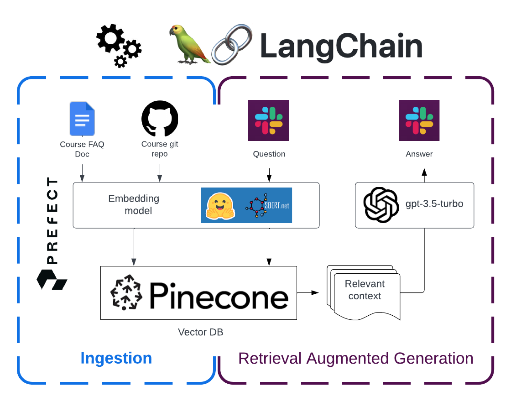

This is a repo for a human-interface Slack chatbot for answering questions
related to MLOps Zoomcamp by DataTalks.Club

## Behind the scenes
Course FAQ Google Document and the Course repo get indexed to the Pinecone vector store.
Then semantic search retrieves the most similar (and hopefully most relevant) pieces to the question asked.
Then this information is passed as a context to a conversational LLM to form the final answer.



# Before you start

Use any python virtual environment manager of your preference 
    and install the dependencies from [requirements.txt](requirements.txt)

# Fill [Pinecone](https://www.pinecone.io/) index
1. Set `PINECONE_API_KEY` and `PINECONE_ENV` 
environmental variables accordingly
 
2. run [ingest/ingest.py](ingest/ingest.py) 

    ```bash
    python ingest.py
    ```
# Test QA pipeline locally 
1. Set `OPENAI_API_KEY`, `PINECONE_API_KEY`, and `PINECONE_ENV` 
environmental variables accordingly
1. Run [test.py](test.py)

    ```bash
    python test.py
    ```
# Launch the bot
1. Set `OPENAI_API_KEY`, `SLACK_APP_TOKEN`, `SLACK_BOT_TOKEN`,
`PINECONE_API_KEY`, and `PINECONE_ENV` 
environmental variables accordingly
1. To launch the bot on the CLI run [slack_bot/main.py](slack_bot/main.py)
    ```bash
   python main.py
   ```

Alternatively it can be launched with Docker, please follow 
[this README](slack_bot/README.md)